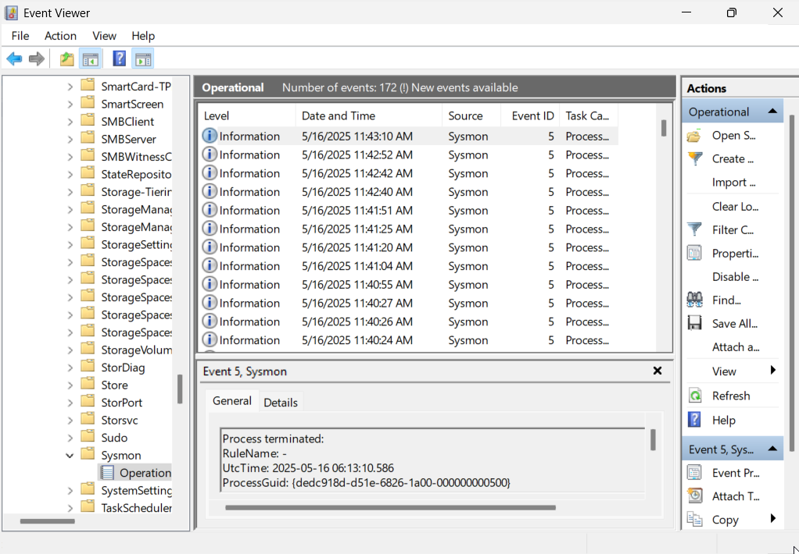
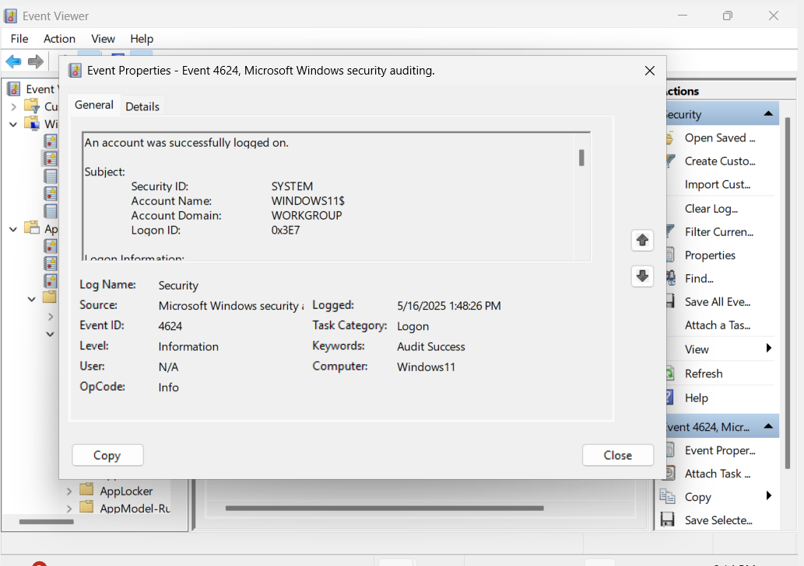
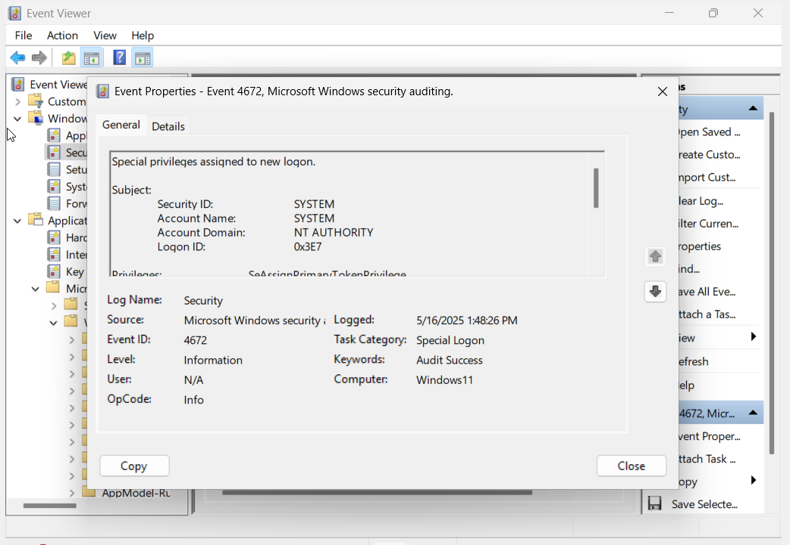

# Phase 1 - Sysmon Setup & Log Collection

## 🛠️ Tools Used:
- Sysmon (System Monitor)
- Event Viewer
- sysmonconfig-export.xml

## 📦 Sysmon Installation Steps:
1. Downloaded the Sysmon zip file from the official Microsoft Sysinternals website.
2. Extracted the zip and kept `Sysmon64.exe` and `sysmonconfig-export.xml`.
3. Opened Command Prompt as Administrator.
4. Installed Sysmon using the following command: Sysmon64.exe -accepteula -i sysmonconfig-v2.xml

5. Sysmon was successfully installed and the service started running.

## 📊 Logs Observed in Event Viewer:
Navigated to Event Viewer > Windows Logs > Security and observed the following Event IDs:
- **4624** - Successful logon
- **4672** - Special privileges assigned to new logon

## 🖼️ Screenshot:

## 📁 Logs:
Detailed logs are saved in the `logs/` folder.
